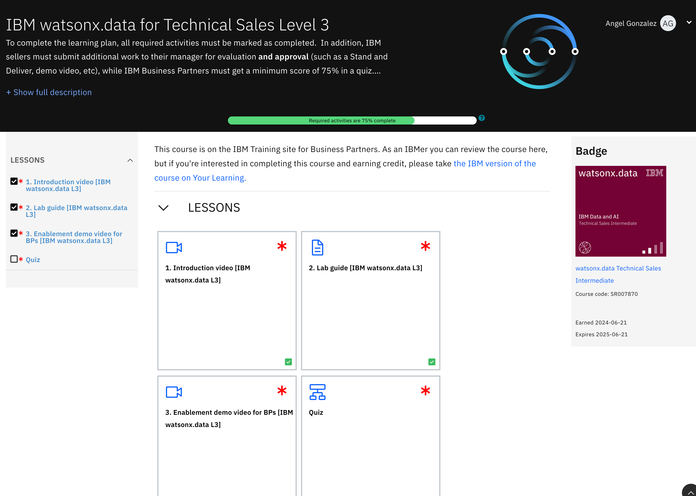

# **watsonx.data Partner Badge Days**

Herzlich Willkommen zu unserem watsonx.data BadgeDays Workshop

Zur Vorbereitung auf unseren Workshop am 5.Dez.2024 bitten wir euch, die folgenden Schritte im Voraus zu erledigen, um einen reibungslosen und produktiven Ablauf sicherzustellen:

## Vorbereitung vor dem Kurs

- Link zum L3-Badge-Kurs: [IBM watsonx.data for Technical Sales Level 3](https://learn.ibm.com/course/view.php?id=13171){:target="_blank"}

Bitte schaut euch vor dem Workshop die folgenden Videos vom Kurs an (siehe Screenshot):

- 3-Minuten-Video (*1. Introduction Video*)
- 11-Minuten-Video (*3. Enablement Video*)

## Zugangsvoraussetzungen

**IBMid erforderlich:**  Als Partner benötigt Ihr einen gültigen IBMid, um Zugriff auf Seismic und die Techzone zu erhalten. Dieser Zugriff ist notwendig, um die Techzone-Images für das Level 3 Training zu nutzen.

### Besondere Voraussetzungen  

**SSH/Terminal Setup**

- Für Windows: Bitte installiert Putty für den SSH-Zugriff.
- Für MacOS: Stellt sicher, dass das Terminal-Programm einsatzbereit ist.

**Internetverbindung**

Stellt sicher, dass euer Netzwerkzugang zu folgenden Domains möglich ist:

- `*.ibm.com`
- `*.box.com`

## Ablauf des Workshops

- Kurze Einführung (~30 Minuten): Wir werden  eine Einführung in watsonx.data geben, was es ist und wofür es verwendet wird (Use Cases).
- Live-Demo (~10 Minuten): Anschließend zeige ich in einer Live-Demo, wie man sich in der UI von watsonx.ai zurechfindet.
- Version 2.0.2: Wir verwenden Version 2.0.2, da diese zur Level 3 Anleitung passt, obwohl bereits eine neuere Version verfügbar ist.
- Eigenständiges Arbeiten (~1 Stunde): Danach folgt ihr der Lab-Anleitung selbstständig (meist Copy & Paste) und lest/versteht die Inhalte. IBM
- Offene Diskussion (~30-60 Minuten): Wir haben dann eine offene Diskussion, falls noch Fragen bestehen.
- Badge (~10 Minuten): Abschließend könnt ihr euch den Badge verdienen: Level 3 Badge. (5 Fragen)

## Wichtige Links

- Techzone Image: [Link zur Techzone Developer Image](https://techzone.ibm.com/collection/ibm-watsonxdata-developer-base-image){:target="_blank"}
- Dokumentation für das IBM watsonx.data Development Lab (Version 2.0.2 GA) für die Level 3 Zertifizierung: [Link zur Dokumentation](http://ibm.biz/wxd-lab){:target="_blank"}
- IBM Seismic: [Link zur Seismic](https://ibm.seismic.com){:target="_blank"}
- IBM Techzone (w3id): [Link zur Techzone](https://techzone.ibm.com){:target="_blank"}

## Präsentation

Das ist ein tieferer Einblick in watsonx.data

[Präsentation - PDF Datei](./media/wxdatabadgedays.pdf)  

Vorschau der Präsentation:

<iframe width="100%" height="800" src="./media/wxdatabadgedays.pdf">